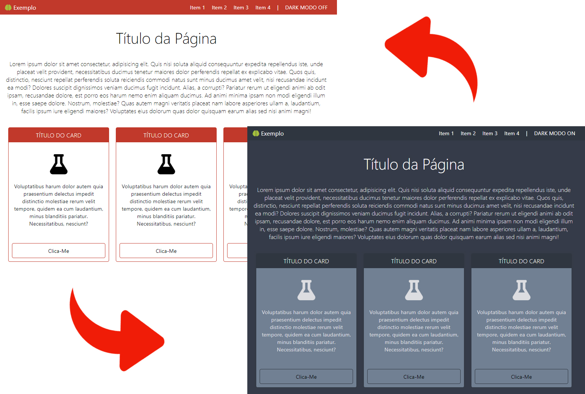

# :art: Dark Mode
Exemplo de uma página com o botão para ligar/desligar o modo escuro.

## :computer: Tecnologias
> HTML 5  
> CSS 3  
> Javascript  

## :floppy_disk: Resultado

## Demonstração
https://jeihcio.github.io/pagina-com-darkmode/
